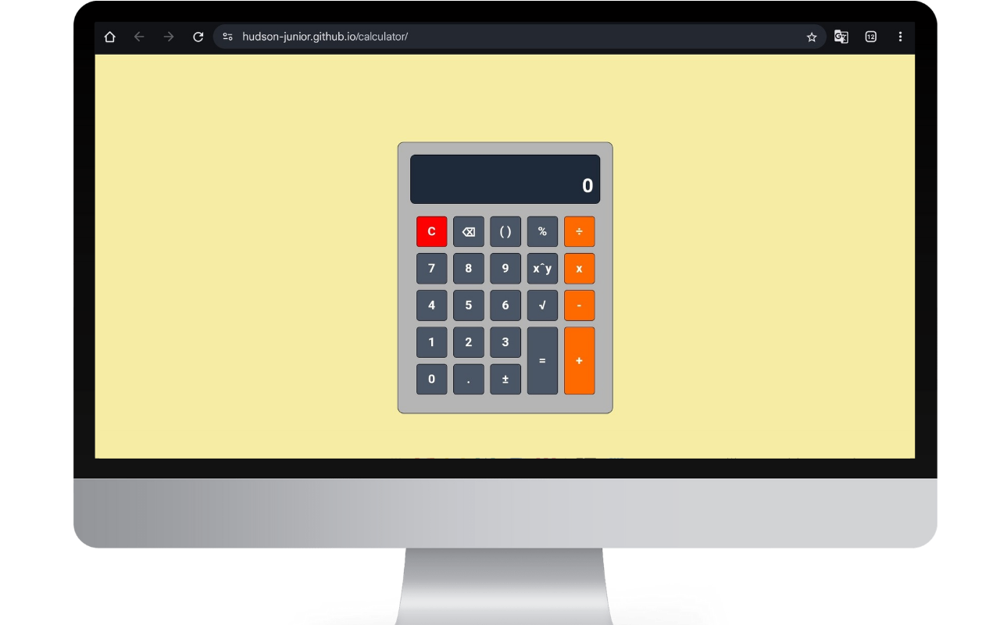
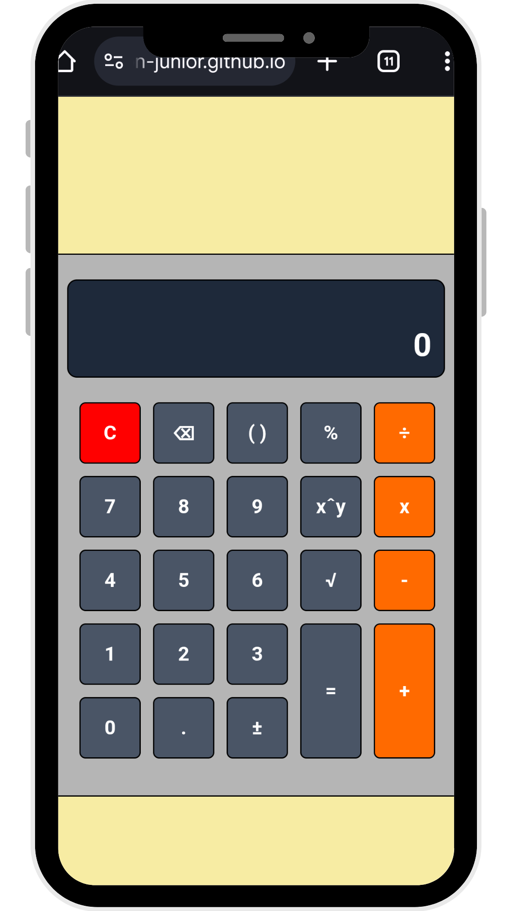

# 📱 Calculadora Personalizada

---

## 🇧🇷 Versão em Português

### 📋 Descrição

Este projeto é uma **calculadora interativa** desenvolvida com HTML, CSS e JavaScript, que simula uma calculadora real, oferecendo suporte a:

- Operações básicas: soma, subtração, multiplicação e divisão  
- Potenciação e raiz quadrada  
- Porcentagem  
- Uso de parênteses  
- Correção do último dígito (⌫)  
- Inversão de sinal (±)  
- Atualização em tempo real do resultado conforme o usuário digita

---

### ⚙️ Tecnologias utilizadas

- HTML5  
- CSS3  
- JavaScript puro  
- Responsividade com Media Queries

---

### 🖥️ Funcionalidades

- Interface amigável com dois visores: expressão e resultado  
- O visor principal mostra o número atual  
- O visor superior mostra a expressão em tempo real  
- Ao clicar em "=", o resultado sobe e a calculadora fica pronta para novo cálculo  
- Suporte a uso de operadores após o resultado anterior  
- Responsivo para celulares e desktops

---

### 📷 Preview do projeto / Project Preview

  
  

---

### ✅ Projeto finalizado

### 🧑‍💻 Desenvolvido por

Hudson Júnior  
 • 

---

## 🇺🇸 English Version

### 📋 Description

This project is an **interactive calculator** developed with HTML, CSS, and JavaScript, simulating a real calculator. It supports:

- Basic operations: addition, subtraction, multiplication, and division  
- Exponentiation and square root  
- Percentage calculations  
- Use of parentheses  
- Last digit correction (⌫)  
- Sign inversion (±)  
- Real-time result updates as the user types

---

### ⚙️ Technologies Used

- HTML5  
- CSS3  
- Vanilla JavaScript  
- Responsive design with Media Queries

---

### 🖥️ Features

- Friendly interface with two displays: expression and result  
- Main display shows the current number  
- Top display shows the full expression in real-time  
- When "=" is pressed, the result moves up and the calculator is ready for a new calculation  
- Supports using operators immediately after a result  
- Fully responsive for mobile and desktop devices

---

### 📷 Preview of the Project / Preview do projeto

  
  

---

### ✅ Project Completed

### 🧑‍💻 Developed by

Hudson Júnior  
 • 
